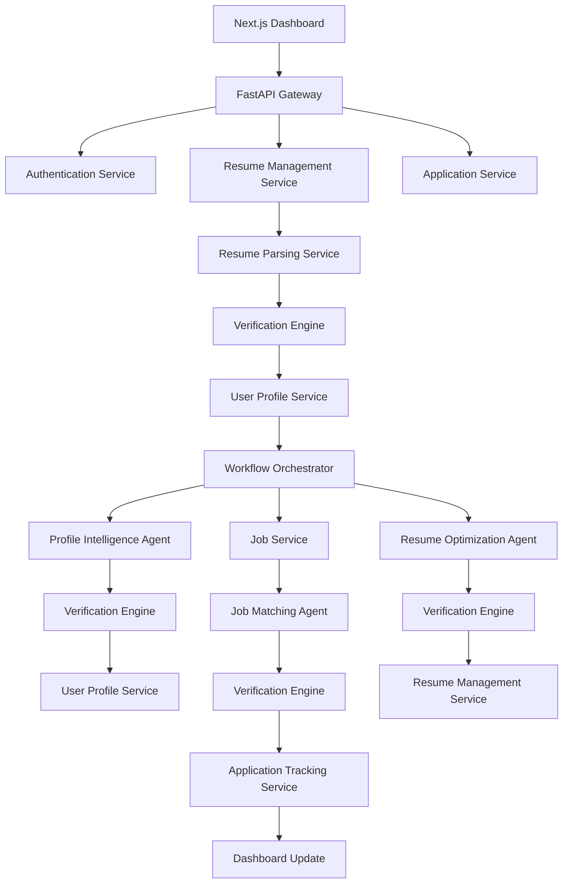

# CareerOS

> CareerOS is a multi-agent career guidance platform which helps in profile analysis, search for jobs aligned with the user profile and optimize the resume based on the JD and available information on the user.

- **Services**: handle deterministic operations such as file management, database interactions, API integrations, and parsing.
- **Agents**: handle reasoning tasks using Large Language Models (LLMs) and produce intelligent outputs.

## System Architecture

### Workflow Diagram



### Services
- **Authentication Service**: Handles user registration, login, JWT/session validation (NextAuth v5).
- **Resume Management Service**: Manages resume upload, storage, versioning, retrieval and optimized resume versions.
- **Resume Parsing Service**: Extracts structured information from resumes (PyMuPDF, python-docx) and converts it into a validated ResumeSchema.
- **User Profile Service**: Stores and manages the canonical user profile including the parsed ResumeSchema and AI-generated Career Profile.
- **Job Service**: Fetches jobs from providers (Adzuna), normalizes them, stores recommendations and exposes search/filter functionality.
- **Application Service**: Tracks job applications, interview stages, offers and application history.

### AI Agents
- **Profile Intelligence Agent**: 
  - Infers career level, preferred roles, strengths, weaknesses, domains and career summary from the ResumeSchema.
  - Uses the Github Link from the resume to get information about the projects.
- **Job Matching Agent**: 
  - Matches the user's career profile with available jobs, ranks them and provides reasons and missing skills (Sentence-Transformers).
- **Resume Optimization Agent**: 
  - Generates a job-specific ATS-optimized resume while preserving factual correctness.

### Verification Engine
The Verification Engine is reused after parsing and after every AI agent. It performs schema validation (Pydantic), rule validation, cross-validation and optional LLM verification before data is persisted.

### Why a Workflow Orchestrator?
The Workflow Orchestrator coordinates agent execution without making agents depend on each other. It determines which agent should run for a given user action, manages retries and failures, tracks workflow progress, logs execution, and allows agents to be reused independently in different workflows (resume upload, job refresh, resume optimization, future roadmap generation, etc.). This keeps the architecture modular, extensible and easier to maintain.

## Tech Stack

| Layer | Technology |
|---|---|
| Frontend | Next.js 16 (App Router, TypeScript, React 19) |
| Auth | NextAuth v5 (Auth.js) |
| Database | Supabase (PostgreSQL, JSONB) |
| Backend & Gateway | FastAPI (Python 3.11), Uvicorn |
| Data Processing | PyMuPDF, python-docx, Pydantic, Playwright |
| AI & Embedding | NVIDIA NIM (Llama 3.1), OpenAI SDK, Sentence-Transformers |
| Concurrency | Concurrently (Node), APScheduler (Python) |

## Getting Started

### 1. Prerequisites

- **Node.js** (v18+)
- **Python 3.11+**
- A **Supabase** project
- An **NVIDIA NIM** API key
- **Adzuna** API credentials (for Job Service)
- **GitHub** Personal Access Token (for Profile Intelligence Agent)

### 2. Configure Environment Variables

Create `.env` in both the `frontend/` and `backend/` directories.

**frontend/.env**:
```env
# Auth.js (NextAuth v5)
AUTH_SECRET=<your-auth-secret>
NEXTAUTH_URL=http://localhost:3000

# Supabase
NEXT_PUBLIC_SUPABASE_URL=<your-supabase-url>
NEXT_PUBLIC_SUPABASE_ANON_KEY=<your-anon-key>
SUPABASE_SERVICE_KEY=<your-service-role-key>

# External APIs
NVIDIA_API_KEY=<your-nvidia-nim-key>
GITHUB_TOKEN=<your-github-token>
MODEL=meta/llama-3.1-8b-instruct

# Job API
ADZUNA_APP_ID=<your-adzuna-id>
ADZUNA_APP_KEY=<your-adzuna-key>
JOOBLE_API_KEY=<your-jooble-api-key>
NEXT_PUBLIC_APP_URL=http://localhost:3000
```

**backend/.env**:
```env
# Supabase
SUPABASE_URL=<your-supabase-url>
SUPABASE_PUBLISHABLE_KEY=<your-publishable-key>
SUPABASE_SERVICE_KEY=<your-service-role-key>

# Config
ALLOWED_ORIGINS=http://localhost:3000
MAX_FILE_SIZE_MB=10

# External APIs
NVIDIA_API_KEY=<your-nvidia-nim-key>
MODEL=meta/llama-3.1-8b-instruct
ADZUNA_APP_ID=<your-adzuna-id>
ADZUNA_APP_KEY=<your-adzuna-key>
JOOBLE_API_KEY=<your-jooble-api-key>
```

### 3. Database Migration

Go to your Supabase Dashboard → **SQL Editor** and run the following migration scripts found in the `database/` folder in order:
1. `supabase_migration.sql`
2. `nextauth_migration.sql`
3. `jobs_migration.sql`
4. `match_jobs.sql`

### 4. Setup Project

Install dependencies for both frontend and backend (creates Python virtual environment automatically):
```bash
npm run setup
```

### 5. Start Development Server

Run both Next.js frontend and FastAPI backend concurrently:
```bash
npm run dev
```

- Frontend will be available at [http://localhost:3000](http://localhost:3000)
- Backend API will run on [http://localhost:8000](http://localhost:8000)